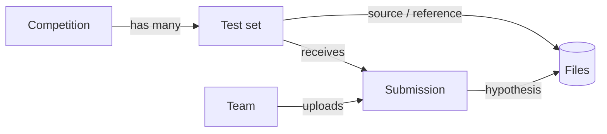

# OCELoT Overview

**OCELoT** — **O**pen, **C**ompetitive **E**valuation **L**eaderboard **o**f
**T**ranslations — is a web platform for running competitive evaluations of
machine translation (and, more recently, other generative NLP) output. It lets
organizers host shared tasks, accept system submissions from participating
teams, score them automatically, and publish ranked leaderboards.

OCELoT started at the Fifth Machine Translation Marathon in the Americas (2019)
and has since been used for several shared tasks, including the **WMT General MT
Task** (since 2020), **IWSLT** tasks, and the **WMT25** General MT, Slavic LLM,
and Multilingual Instruction (MIST) tasks.

- **Stack:** Django (Python 3.10+), SQLite by default or PostgreSQL in
  production.
- **Scoring:** [sacreBLEU](https://github.com/mjpost/sacrebleu) (BLEU + chrF),
  plus accuracy for QA-style tasks.
- **License:** BSD 3-Clause.
- **Source:** [github.com/AppraiseDev/OCELoT](https://github.com/AppraiseDev/OCELoT)

> This document is a high-level, user-friendly tour of what OCELoT offers. For
> installation steps see [INSTALL.md](../INSTALL.md); for the change history see
> [CHANGELOG.md](../CHANGELOG.md).

---

## Who uses OCELoT?

| Role | What they do |
| --- | --- |
| **Participant / Team** | Register a team, download test sets, upload system outputs, view scores, compare outputs, and mark primary/contrastive systems. |
| **Organizer / Admin** | Create competitions and test sets, upload sources and references, verify teams, manage submissions, and export files — all via the Django admin panel. |

---

## Key concepts

OCELoT is organized around four main objects:

- **Competition** — A shared task or campaign. Has a name, description, an
  optional **start time** and **deadline**, and active/public flags. Multiple
  competitions can run **at the same time**, each with its own schedule.
- **Test set** — A dataset within a competition, defined by a source file and
  (optionally) a reference file, a source/target language pair, and a file
  format. Test sets can be single-language-pair or **multi-language** (where the
  source/target language is left unset).
- **Team** — A participant identity, identified by name + e-mail + a generated
  **access token**. Teams can be verified, flagged, or removed.
- **Submission** — A system output uploaded by a team for a specific test set.
  Each submission is automatically scored and can be flagged as primary,
  contrastive, withdrawn, constrained, open-source, etc.

---

## Features

### Competitions and leaderboards
- Run **multiple competitions concurrently**, each with independent start times
  and deadlines (deadline/start time are both optional).
- Per-competition **leaderboards** show the top submissions per test set,
  ranked by chrF (or by submission order when scoring is disabled).
- The front page lists all active competitions with test-set and submission
  counts and a live deadline counter (in server timezone, UTC).
- Result tables are sortable client-side (jQuery tablesorter).

### Team registration and access
- Teams **self-register** with a name and e-mail and receive a unique **token**
  used to sign in (no password). Team names must match
  `^[a-zA-Z0-9_\- ]{2,32}$`.
- **Verification gate:** only verified teams may create submissions.
- Teams can record publication metadata — **institution name**, **system
  (publication) name**, **system paper / URL**, and a **description paragraph**
  intended for a shared-task overview paper.

### Submissions
- Upload system output for any open test set through the web form.
- **Submission limit:** up to **20 valid submissions** per team per test set.
- **Primary vs. contrastive:** each team designates one *primary* system per
  test set (used for the official ranking) and optionally one *contrastive*
  system. If no primary is chosen, OCELoT defaults to the highest-scoring (or
  latest) submission.
- **Withdraw** from a test set/language pair you don't want to participate in.
- Tag systems as **constrained**, **open-source**, or **closed** for the
  overview reporting.
- **Visibility control** is resolved in three tiers (competition overrides test
  set, which overrides submission): a submission can be public or anonymous on
  the leaderboard accordingly.

### Automatic scoring
- **BLEU** and **chrF** via sacreBLEU are computed on save for every submission
  that has a reference.
- Tokenization is chosen by target language: `13a` by default, `char` for
  Japanese (`ja`) and Khmer (`km`), and `zh` for Chinese.
- **QA accuracy:** for test sets whose name contains `-qa`, exact-match accuracy
  (%) is computed instead of BLEU.
- Scoring can be **disabled per test set** (`compute_scores = False`), e.g. for
  human-evaluation-only tasks; the leaderboard then orders by submission instead.
- Test sets **without a reference** are supported (no automatic scores computed).

### Output viewing and comparison
- View a submission's output **segment by segment** (100 segments per page),
  aligned with the source.
- **Compare two submissions** of the same test set side by side, with
  **word-level (or character-level) diff highlighting** of the differences.

### Admin tools (Django admin)
- Create/edit competitions, languages, test sets, teams, and submissions.
- **Bulk download** submission files or test-set files (source/reference) as ZIP
  archives.
- Inspect format and validity flags for each submission.

---

## Supported file formats

OCELoT accepts several formats for both test sets and submissions. The format is
detected from the file extension.

| Format | Extensions | Typical use |
| --- | --- | --- |
| **XML** | `.xml` | WMT XML format (default); validated against a RelaxNG schema. Supports documents, collections, domains, multiple references. |
| **JSONL** | `.jsonl`, `.jsonl.gz` | WMT25 General MT and Slavic LLM (MT / QA) tasks. One JSON object per line. |
| **JSON** | `.json`, `.json.gz` | WMT25 Multilingual Instruction (MIST) task. A JSON array of objects. |
| **Text** | `.txt` | Plain one-segment-per-line text. |
| **SGML** | `.sgm` | Legacy WMT SGML format (validated against an XSD schema). |

`.gz`-compressed JSONL and JSON uploads are supported and decompressed
automatically.

### JSONL format auto-detection
For JSONL files OCELoT inspects the first record and selects a schema:

- **WMT25 General MT** — objects with `dataset_id`, `doc_id`, `tgt_lang`
  (translation fields like `src_text` / `hypothesis`).
- **WMT25 Slavic MT** — `dataset_id` starting with `wmtslavicllm2025_`, with
  `sent_id`, `source`, `target`, `pred`.
- **WMT25 Slavic QA** — `dataset_id` starting with `wmtslavicllm2025_qa`, with
  `correct_answer` / `pred`.

### Validation
When uploading, OCELoT validates submissions before scoring them:
- File extension must match the declared format.
- Format-specific **schema validation** (RelaxNG for XML, XSD for SGML, JSON
  Schema for JSON/JSONL).
- Submissions must contain output from **exactly one system**.
- The submission must have the **same number of segments/lines/items as the
  source** test set; mismatches mark the submission invalid.
- Validation can be **disabled per test set** (`validate = False`).

---

## Typical workflows

### Participant
1. **Register** a team (name + e-mail) on the sign-up page and save the token
   shown on the welcome page.
2. Wait to be **verified** by an organizer (required to submit).
3. **Download** the relevant test set(s) from the download page / task pages.
4. Run your system and **upload** the output on the submit page (XML, JSONL, or
   JSON, optionally `.gz`).
5. On your **team page**, review scores, pick **primary**/**contrastive**
   systems, set constrained/open-source flags, withdraw unwanted test sets, and
   fill in publication metadata.
6. Optionally **view** your output and **compare** it against other public
   submissions.

### Organizer
1. In the **admin panel**, create a `Competition` (with start time/deadline) and
   the `Language` entries you need.
2. Create `TestSet`s, uploading the **source** and (optional) **reference**
   files; choose the file format, scoring, and validation options.
3. **Verify** participating teams so they can submit.
4. Watch the **leaderboard** populate as submissions arrive and are scored.
5. **Export** submissions and test-set files via the admin bulk actions.

---

## Pages at a glance

| Page | Path | Purpose |
| --- | --- | --- |
| Home / front page | `/` | List of active competitions. |
| Leaderboard | `/leaderboard/<id>` | Ranked submissions per test set for a competition. |
| Sign up | `/signup` | Register a new team. |
| Sign in / out | `/sign-in`, `/sign-out` | Token-based team session. |
| Welcome | `/welcome` | Shows the team token after registration. |
| Submit | `/submit` | Upload a system submission (verified teams). |
| Team page | `/teampage` | Manage submissions, primary/contrastive, publication info. |
| Updates | `/updates` | Competition announcements. |
| Download | `/download` | Links to test-set downloads. |
| Submission view | `/submission/<id>` | Segment-level output viewer. |
| Comparison | `/submission/<a>/<b>` | Side-by-side diff of two submissions. |
| Admin | `/admin/` | Organizer management console. |

---

## Technology and acknowledgments

- **Django** web framework; **SQLite** (development) or **PostgreSQL**
  (production) for storage.
- **sacreBLEU** for BLEU/chrF metrics.
- **lxml**, **xmlschema**, **jsonschema**, and **BeautifulSoup** for format
  validation and parsing.
- **compare-mt** (NeuLab, BSD 3-Clause) for fine-grained MT comparison.
- **jQuery tablesorter** (MIT) for sortable leaderboards.

OCELoT is released under the BSD 3-Clause License.
